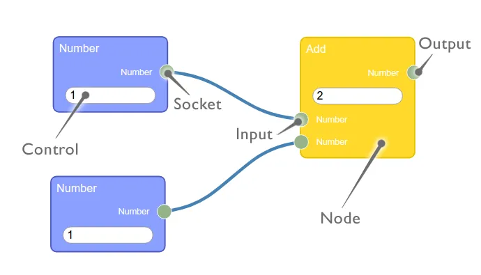

# vue3
25년 9월 기준 VITE 7.1.5 기반 vue 최신 프로젝트는 node 22 버전 이상을 요구합니다.  
따라서 기존 node 버전이 낮을경우 버전업이 필요합니다.  
만약 여러 프로젝트를 관리하고 있고 프로젝트별 node 버전이 다를 경우 nvm-window를 통해 프로젝트별로 여러개의 node 버전을 설치하여 편하게 변경/관리할 수 있습니다.  

## node 22버전 이상 설치

## nvm-window
[nvm-window git repository](github.com/coreybutler/nvm-windows/releases)

nvm-setup.exe 파일을 설치합니다.
- node 목록 확인
  ```bash
  nvm ls
  ```
- node 버전 변경
  ```bash
  nvm use {버전}
  ```


## Project setup
```
npm create vue@latest
```

```
npm install
```

# rete.js (v2)

## 설치 가이드

```bash
npm install rete rete-area-plugin rete-connection-plugin rete-render-utils rete-vue-plugin  
```

## 핵심 구성 요소
- Version2에서는 Version2에서 노드를 생성하고 동작을 정의하는 설계도인 Component가 추상화로 포함되어 있지 않으며 Presets 개념이 신규 도입됨. (version2에는 없는 개념)
- rete 버전 2에서는 Editor의 캔버스 영역을 관리(노드 배치, 줌, 패닝 등)하는 AreaPlugin이 추가됨. (editor에 해당 플러그인을 등록해야함.)
  - 해당 플러그인을 사용하지 않더라도 렌더링은 가능하지만, 확대,축소 등의 캔버스 전체를 제어하는 기능은 플러그인을 활용해야만 가능.



### [**Nodes**](https://rete.js.org/#/docs/nodes)

- 데이터와 포트의 집합으로 데이터 플로우 그래프에서 정점을 표현한다.
- rete 에서 Node는 블록 형태로 출력되며, 모든 Node에는 title, input, output 및 control을 포함한다.
    
    ### **`Nodes 구성 요소`**
    
    - **title**
        - Node를 식별하고 그 목적을 명확하게 나타내야 한다.
    - **i/o** (input/output)
        - 노드가 데이터를 받는 포트이다.
        - 모든 input/output은 같은 socket을 공유해야 연결이 가능하다.
        - 큰 개념으로는 input socket, output socket으로 이해하고 사용한다.
    - **Socket (input/output)**
        - input, output을 연결하는 타입/규격이다.
            - 어떤 소켓을 통해 입출력을 연결했는가 라고 예를 들 수 있음.
        - input은 왼쪽, output은 오른쪽에 위치해야한다.
        - input이 1이라면 output은 N(이하 포함). 
        input과 output간의 관계는 1:N(이하 포함) 관계만 지원한다.
    - **controls**
        - Node 자체 상태값을 설정하기 위한 값을 입력을 받을 수 있는 입력란
        - Node 자체에 직접 위치하거나 특정 Input에 연결될 수 있다.
            - Node에 위치할 경우 상태값을 설정
            - Input 소켓에 위치할 경우 `연결값이 없을 때만 동작`하는 임시값으로 사용된다.

### [**Sockets**](https://rete.js.org/#/docs/sockets)

- 노드의 입/출력 타입(type)을 정의하는 역할
- 어떤 값(output)이 어떤 노드(input)로 연결될 수 있는지 결정
- 사용자는 입/출력(input/output)으로 이해하지만, 실제 input/output 객체에 socket을 등록해 줘야 한다.
    - socket이 입/출력을 연결하는 타입/규격 이기 때문이다.
- `Nodes 구성요소`로 앞서 설명한바 있음.

### [**Controls**](https://rete.js.org/#/docs/controls)

- 노드의 기능을 확장하는데 필요하다.
- HTML 템플릿 등을 삽입할 수 있다.
- `Nodes 구성요소`로 앞서 설명한바 있음.

### [**Editor**](https://rete.js.org/#/docs/editor)

- 시각적으로 노드를 화면에 배치하고 연결을 관리하는 역할
- 내부 데이터 처리 로직은 포함하지 않는다
- 생성된 노드 객체를 등록하고, 식별 데이터를 통해 꺼내 사용한다.

### [**Engine**](https://rete.js.org/#/docs/engine)

- 실제 데이터 처리를 담당.
- 노드의 스트림을 기반으로 데이터를 처리하고 출력 데이터에서 입력 데이터로 전송이 가능.
- 화면상에 보이는 Node들은 단순히 editor에 의해 출력되는 반면 실제 값이 어떻게 흐르고 결과가 나오는지는 엔진이 담당함.

### [**Plugin**](https://rete.js.org/#/docs/plugins/connection)

- Editor의 기능을 확장하기 위한 모듈
- 드래그 앤 드롭, 연결선 표현, 미니맵, 키보드 단축키 등
- npm패키지로 제공되며 추가로 필요한 플러그인은 따로 설치해줘야 한다.

### [**Events**](https://rete.js.org/#/docs/events)

- Editor 내부에서 발생하는 동작을 감지하고 처리할 수 있는 기능

### [**Presets**](https://retejs.org/docs/concepts/presets)

- Rete v1에는 없던 개념이며, v2에서 새로 도입되어 플러그인을 직접 조합하거나 구현하지 않고도 손쉽게 사용 가능.
- Editor의 기반이 되는 사전 구성된 기능(구조, 렌더링, 인터렉션 등)들의 모음
    - `Classic`Preset: 데이터 구조 클래스를 제공
        - Rete에서 데이터구조 관점에서 정의된 클래스는 Node, Connection, Socket, Input, Output, Control 이 있다.
    - (`Render`)Presets: 화면에 노드, 메뉴, 컨트롤 표시방식 제공
        - React, Vue 등 각 렌더 플러그인에서 제공하며, 데이터 구조를 기반으로 클래식 노드를 표현해준다.
    - (`Connection`)Presets: 포트 연결, 드래그, 삭제 등 사용자 행동을 처리하는 기능 제공
- 동일한 범주의 다른 프리셋이나 커스텀 프리셋으로 수정하여 사용 가능하다.